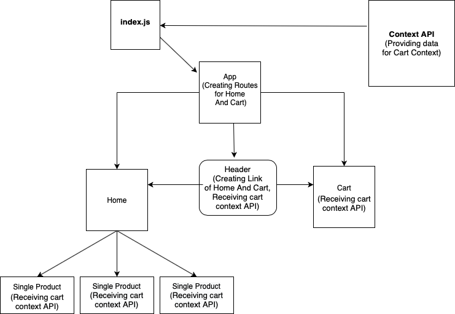
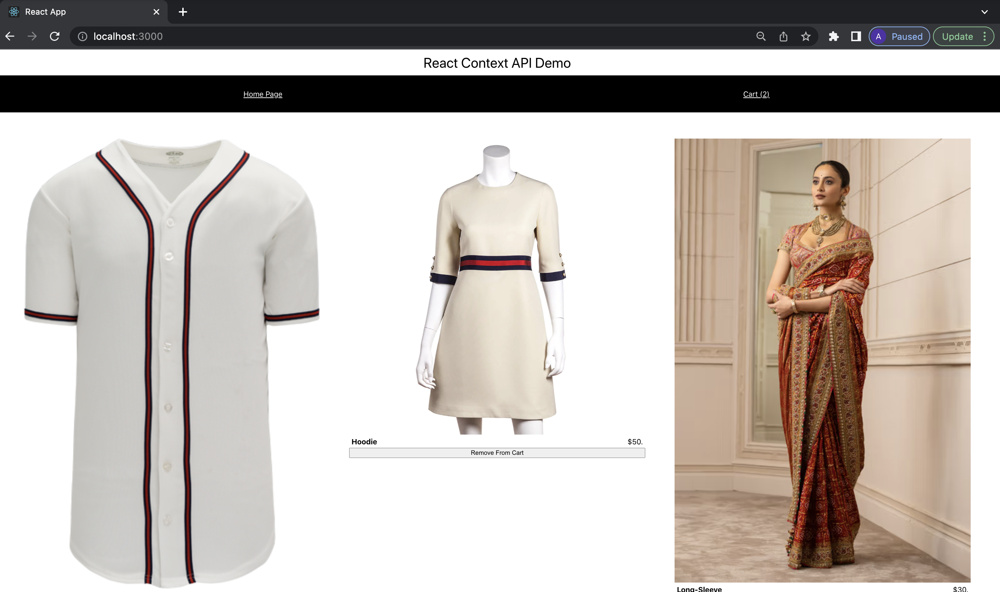
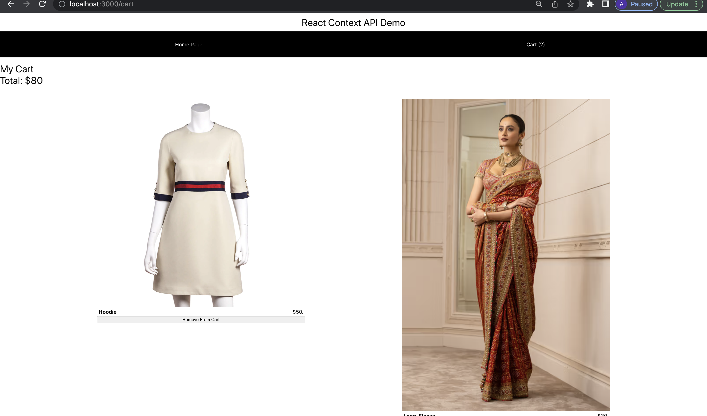

Shopping Cart with React

FlowChart of Application

1. Home Page -> add product to cart, remove from cart

2. Cart page -> display product added to cart, remove from cart and display total amount

